### 🪐 About Me

  

- 🛰️ Building **GeoVision** — deep-learning super-resolution that turns 10 m Sentinel-2 imagery into sub-4 m representations, with uncertainty maps so you know what's observed vs. estimated.
- 🧠 Built an **AI-Assisted Compiler** that doesn't just report errors — it explains them, repairs them, and recompiles to prove the fix worked. Fully offline.
- 📊 Work across the stack: Next.js + TypeScript on the front, Python/FastAPI and Snowflake on the back.
- 💬 Happy to talk about computer vision, super-resolution, or why your build is slow.

### 🛠️ Tech Stack

**Languages**

**AI / ML / Data**

**Web & Infra**

### 🚀 Featured Projects

<table>
<tr>
<td width="50%" valign="top">

#### 🛰️ [GeoVision](https://github.com/AmizhthanX/geovision-final)
Deep-learning super-resolution for Sentinel-2 satellite imagery. In-browser Real-ESRGAN 4×, with confidence maps separating observed detail from AI-estimated detail.

`Next.js` `TypeScript` `Neon` `Real-ESRGAN`

**[▶ Live Demo](https://geovision-gules.vercel.app)**

</td>
<td width="50%" valign="top">

#### 🧠 [AI-Assisted Compiler](https://github.com/AmizhthanX/ai-assisted-compiler)
A Mini-C compiler that explains syntax and semantic errors in plain language, repairs them, and recompiles to prove the fix works. Runs entirely offline.

`Python` `Compilers` `LLM`

</td>
</tr>
<tr>
<td width="50%" valign="top">

#### 🎵 [ConcertHub](https://github.com/AmizhthanX/concerthub-snowflake-streamlit)
Concert ticketing and revenue analytics platform — discovery, booking, inventory, and BI dashboards on a Snowflake backend.

`Snowflake` `Snowpark` `Streamlit` `Python`

</td>
<td width="50%" valign="top">

#### 🎮 [Player Behavior Analytics](https://github.com/AmizhthanX/player-behavior-analytics)
Churn prediction and behavioral segmentation from raw game-server logs.

`Python` `ML` `Data Engineering`

</td>
</tr>
</table>

### 🌌 GitHub Stats

  

Cards are generated from the GitHub API, animated in pure SVG, and refreshed daily by <a href="./.github/workflows/refresh-cards.yml">a workflow</a> — no third-party services.

